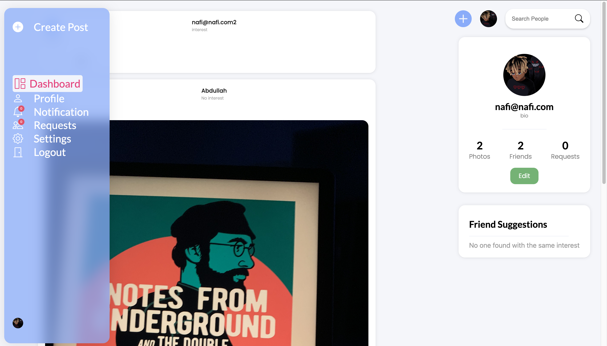
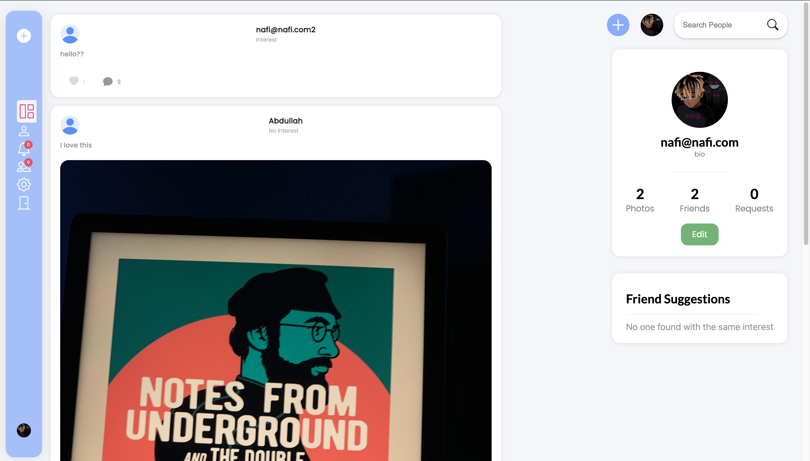
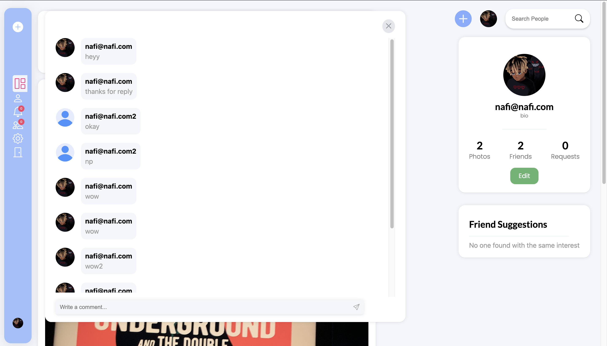
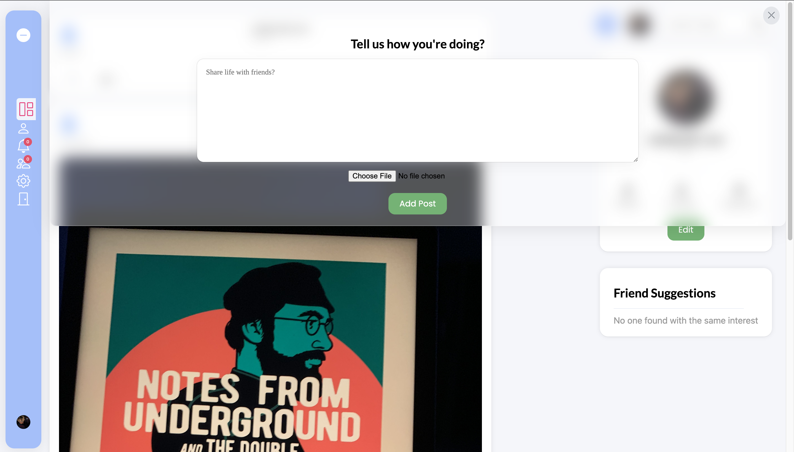
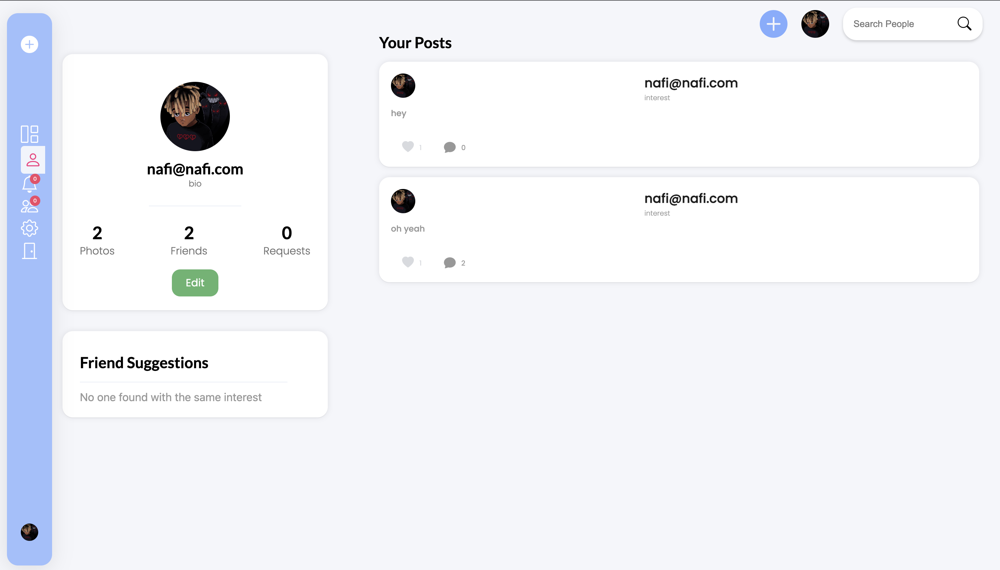
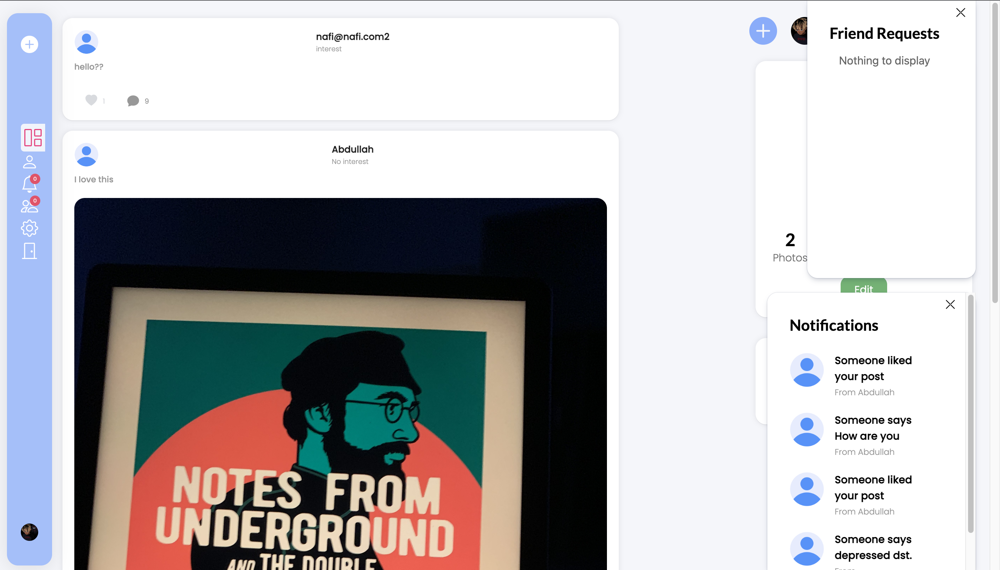
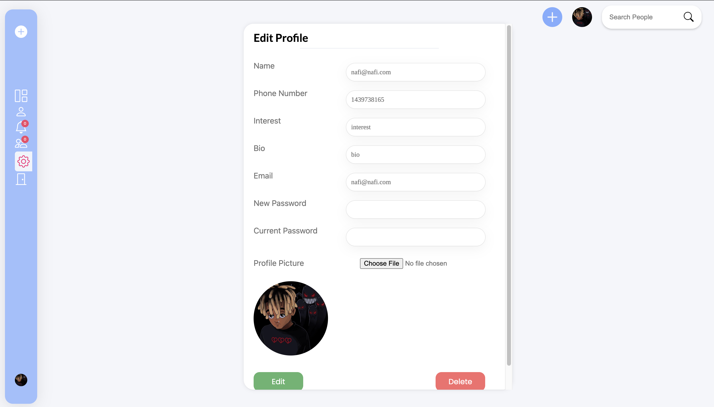
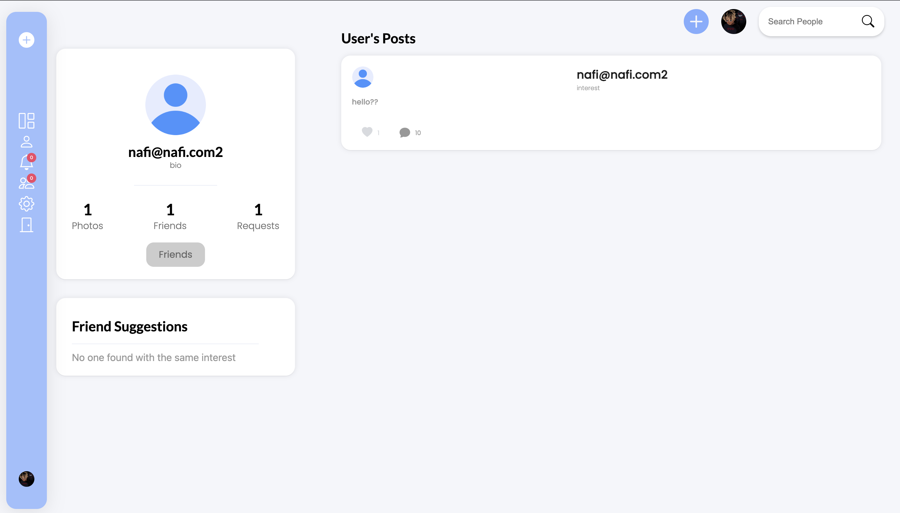

## How to run:

* Install docker

* Make a new file named `config.env` on the directory `{project root directory}/server`, and set it up following example.config.env. You need to setup mongoDB, JWT, and cloudinary

* Go to the root project directory and run `docker-compose up`

* Go to url `http://localhost:3000/login`. Done!! Super simple since it's already dockerized.

## Attractive Features...

### Authentication System

The application hosts a secure system, where the passwords are encrypted. The sign-up page looks like this. Sign up to start using the application. After successful sign-up, user is redirected to the home page. 

Alternatively, you can use the authentication details you signed up with, to login to the system. 

Forgot Password? Fret not, you can always use the forgot password feature to retrieve your account. It will send an email to the email of the registered account, and guide you to reset your password.

 

Logout option is also available on the side bar

### Side Navbar

The navbar is expanded when hovered, and collapses when unhovered. 

### Home Page

You can use search bar, available throughout the application, to search for your friends, and send a friend request. The posts of the friends appear on the home page. Users with matching interests, also show up, to expand your network. 

You can also like, comment on your friends' posts, and it shows the count of them as shown below:

### Adding posts

Click on the "Add" icon, on the top navbar, to add posts, and you can also add an image if you want, which is securely stored on the cloud, cloudinary

### Profile Page

The profile page shows the list of your posts, and shows the count of likes and comments of each post. Clicking on the like, comment icons shows the details. 

### Notifications and Friend Requests are sent on real-time

You don't have to refresh the page, in order to get the updated list of notifications and friend requests, as it is sent real-time through socket-io, realizing how important the notifications are, sent from friends and family. The options for notifications and friend requests are available on the side navbar

### Settings Page

The settings option is available on the side bar, which can help you alter various settings that you inputted, while you signed up. You can also upload your profile picture, which is also stored securely on the cloud, cloudinary, likewise. The option to delete your account is also available here. 

### Sending friend requests

Once you found the user to add, either by searching on the search bar or through the friend suggestion box, you can send the friend request. The button for sending friend request shows the status, and gets enabled/disabled accordingly. 

